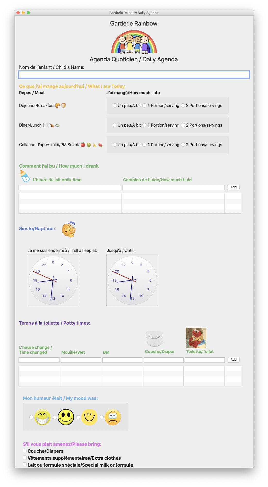

#  Garderie Rainbow Daily Agenda 1.0.0

## Copyright

Logo, business model, and source code are property of [Garderie Rainbow](https://www.garderierainbow.com/) (Montreal), and may not be copied, reused, distributed, or sold. 

The source code is open as a learning tool for building other applications.

Copyright (c) 2020 Garderie Rainbow (Montreal). See [LICENSE.txt](LICENSE.txt) for further details.

--

 Built with [Glimmer](https://github.com/AndyObtiva/glimmer) (Ruby Desktop Development GUI Library)
